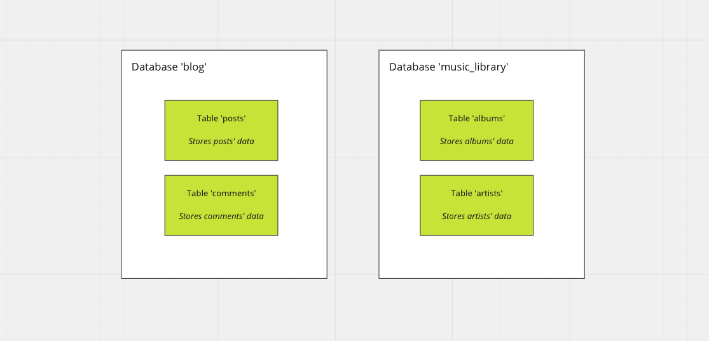

# Using PSQL to run SQL queries

_**This is a Makers Bite.** Bites are designed to train specific skills or
tools. They contain an intro, a demonstration video, some exercises with an
example solution video, and a challenge without a solution video for you to test
your learning. [Read more about how to use Makers
Bites.](https://github.com/makersacademy/course/blob/main/labels/bites.md)_

Learn to use the `psql` REPL to create a database and import data.

## Introduction

The database software (PostgreSQL) runs on our machine and manages the data we need to store.

We interact with it using a language called **SQL**. It's a very different language from Ruby, JavaScript or Python. It comes with different commands to query, create or modify data stored in the database.

On a high-level, SQL allows to us to send **queries** to the database and to things like:
  * Get all the records from a table.
  * Get all the records from a table where some conditions are met (e.g `where the name is "John"`).
  * Create a new record.
  * Update or delete a record where some conditions are met.
  * And more complex things, like create new tables.

Programs that talk to a database to create, read, update or delete data are often called [CRUD](https://en.wikipedia.org/wiki/Create,_read,_update_and_delete) applications.

## Using `psql`

PostgreSQL comes with a built-in REPL, `psql`, that we can use to directly type-in some SQL to interact with the database.

Make sure you can run the command `psql -h 127.0.0.1` to enter the REPL:

```bash
$ psql -h 127.0.0.1

psql (14.2)
Type "help" for help.

leoht=# 
```

*The `-h` option specifies the IP address of the machine PostgreSQL runs on. Here, we use `127.0.0.1`, since it's the local IP address of your own machine, on which PostgreSQL runs.*

## Creating a database

First, something to keep in mind — a database **is not** the same thing as a table.

A table is a structure that contains a list of similar "things", or records (e.g a list of students, or a list of bank accounts).

A database can have many tables and the data they contain. You can create different databases within the same PostgreSQL program, each with their own tables.

Usually you will have one database (at least) for each project.

Below is a diagram showing a possible setup for a PostgreSQL program managing different databases, each one with its different tables.



You will use the same database for these next SQL bites. Create it by running the `CREATE DATABASE` SQL query.

```bash
$ psql -h 127.0.0.1

psql (14.2)
Type "help" for help.
```

```sql
CREATE DATABASE music_library;

-- You should get this output from the REPL
-- acknowledging the database has been created.
CREATE DATABASE
```

**Make sure you don't forget the semicolon at the end.** This is how we "end" an SQL query (otherwise the REPL will keep waiting for the rest of the query, without running anything).

You can now exit the REPL with `\q`.

## Importing the seed data

You've created a database, but it is empty for now, without any table.

In the following sections, you will work using seed data provided by us, with tables that have already been created. All the needed SQL is in the file [`music_database.sql`](../resources/seeds/music_database.sql). You can clone this module's repository to get the file on your machine, or download it directly.

You can have a look at this file if you'd like. It contains SQL queries to:
  * create the tables (the *structure*)
  * insert some records in these tables (the *data* itself)

Here's the general syntax to run SQL from a file using `psql`:
```bash
$ psql -h 127.0.0.1 {database_name} < {file_containing_sql}
```

## Exercise

Use the command described above to load the file `music_database.sql` on the database `music_library`.

You should get the following output:

```
NOTICE:  table "albums" does not exist, skipping
DROP TABLE
CREATE SEQUENCE
CREATE TABLE
NOTICE:  table "artists" does not exist, skipping
DROP TABLE
CREATE SEQUENCE
CREATE TABLE
INSERT 0 12
INSERT 0 4
```

<details>
  <summary>Reveal the command to run</summary>

  ```bash
  $ psql -h 127.0.0.1 music_library < music_database.sql
  ```
</details>

## Demonstration

@TODO Here's a video demonstration.

## Exercise

In the `psql` REPL, connect to the database `music_library`. You can run the usual command to connect to the REPL, followed by the database name: 

```bash
$ psql -h 127.0.0.1 music_library
```

Then run the following SQL query:

```sql
SELECT * FROM artists;
```

It everything worked, you should get the following output, also called a **result set** — you will learn more about this in the next bite. Well done on running your first SQL query!

```
 id |     name     | genre 
----+--------------+-------
  1 | Pixies       | Rock
  2 | ABBA         | Pop
  3 | Taylor Swift | Pop
  4 | Lorde        | Pop
(4 rows)
```

[Next Challenge](03_querying_data.md)

<!-- BEGIN GENERATED SECTION DO NOT EDIT -->

---

**How was this resource?**  
[😫](https://airtable.com/shrUJ3t7KLMqVRFKR?prefill_Repository=makersacademy/databases&prefill_File=sql_bites/02_using_psql.md&prefill_Sentiment=😫) [😕](https://airtable.com/shrUJ3t7KLMqVRFKR?prefill_Repository=makersacademy/databases&prefill_File=sql_bites/02_using_psql.md&prefill_Sentiment=😕) [😐](https://airtable.com/shrUJ3t7KLMqVRFKR?prefill_Repository=makersacademy/databases&prefill_File=sql_bites/02_using_psql.md&prefill_Sentiment=😐) [🙂](https://airtable.com/shrUJ3t7KLMqVRFKR?prefill_Repository=makersacademy/databases&prefill_File=sql_bites/02_using_psql.md&prefill_Sentiment=🙂) [😀](https://airtable.com/shrUJ3t7KLMqVRFKR?prefill_Repository=makersacademy/databases&prefill_File=sql_bites/02_using_psql.md&prefill_Sentiment=😀)  
Click an emoji to tell us.

<!-- END GENERATED SECTION DO NOT EDIT -->
